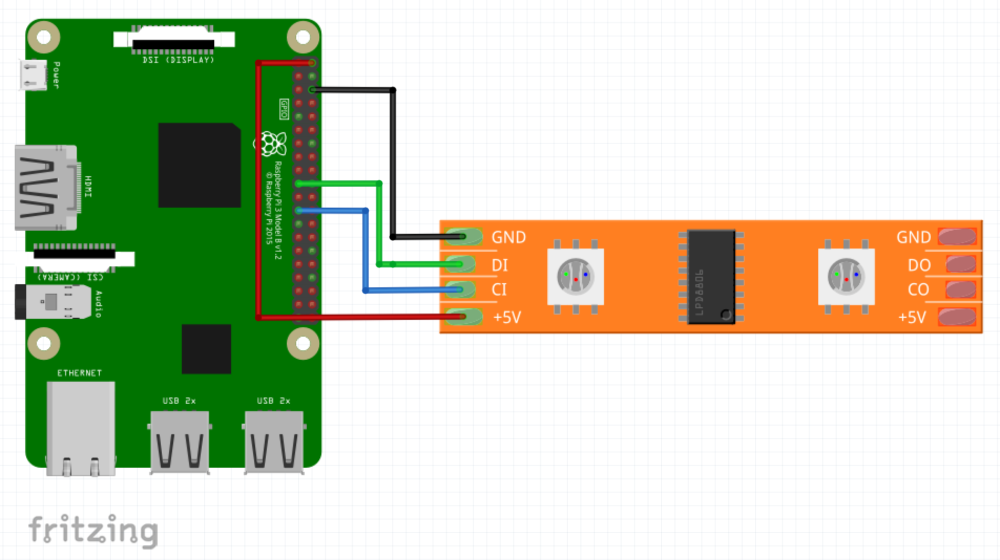

# androidthings-ws2801-driver [  ](https://bintray.com/xrigau/maven/ws2801-driver/_latestVersion)

This repo contains the Android Things driver to control an LED strip based on the WS2801 chip (and should work on similar LED strips as long as the protocol is the same).

The driver can be found in the `ws2801-driver` module and there's a demo app showing how to use the driver in the `demo-app` module.

Only tested with a Raspberry Pi 3 but should work in more devices.

## Schematics




## Using

The driver is now available on jCenter so you can include it as a gradle dependency:

```groovy
dependencies {
  compile 'com.xrigau:ws2801-driver:0.0.1'
}
```

And you can start using it in your Android Things project:

```java
Ws2801 ledstrip = Ws2801.create(SPI_DEVICE_NAME, Ws2801.Mode.RGB);
ledstrip.write(new int[]{Color.parseColor("#0face0")});

// Later on
ledstrip.close();
```
More on the WS2801: https://cdn-shop.adafruit.com/datasheets/WS2801.pdf
